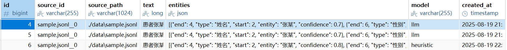
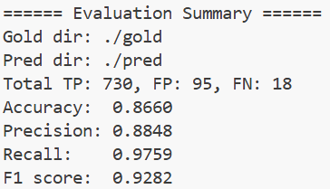
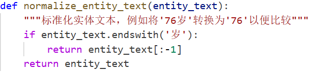

# PII 初步检测模块

本模块实现了任务书中的三部分：
- **功能1：大模型识别（支持 DeepSeek / 启发式规则）**
- **功能2：数据库建立（MySQL）**
- **辅助功能：PII 数据统计（Accuracy / Precision / Recall / F1）**

---

## 1) 环境准备
```bash
# 建议 Python 3.10+
conda create -n pii python=3.10 -y
conda activate pii

pip install -r requirements.txt
```

## 2) 创建数据库与表（MySQL）

```
# 在项目根目录下执行
mysql -u root -p < setup.sql
```

这会创建数据库 `ComplianceWizard` 和表 `person_information`。

表结构：

- `id` 主键
- `source_id` / `source_path` 溯源信息
- `text` 拼接后的完整文本
- `entities` JSON 数组（存储识别结果）
- `model` 使用的识别方法（heuristic / llm）
- `created_at` 时间戳

## 3) 配置环境变量

修改 `.env`，填写：

```
DB_URL=mysql+pymysql://root:密码@localhost:3306/ComplianceWizard

# 选择后端： heuristic 或 llm
BACKEND=llm

# DeepSeek API 配置（OpenAI 兼容接口）
OPENAI_API_KEY=你的_deepseek_api_key
OPENAI_BASE_URL=https://api.deepseek.com/v1
OPENAI_MODEL=deepseek-chat
```

## 4) 准备输入数据

输入目录应包含结构化文本文件，每行是 **JSON 数组**（由上游分词/分句模型产生）。

例如 `data/sample.jsonl`：

```
["患者","张某","，","男","，","45","岁","，","主诉","头痛","3","天"]
["曾","诊断","为","高血压","，","现","服用","降压药"]
["医保卡号","为","12345678","，","进行","MRI","检查","并","开具","电子","处方"]
```

## 5) 运行识别流水线（功能1）

### 使用启发式规则（无需联网/模型，效果很差）

```
python -m src.pipeline --input ./data --output ./outputs --backend heuristic
```

### 使用 DeepSeek 大模型识别

```
python -m src.pipeline --input ./data --output ./outputs --backend llm
```

运行结果：

- 在 `./outputs/` 生成 JSON 文件
- 同时写入 MySQL 的 `ComplianceWizard.person_information` 表

### 输出 JSON 示例

```
{
  "tokens": ["患者","张某","，","男","，","45","岁"],
  "entities": [
    {"entity": "张某", "type": "姓名", "start": 1, "end": 2},
    {"entity": "男", "type": "性别", "start": 3, "end": 4}
  ]
}
```

数据库中会保存 `''.join(tokens)` 作为 `text` 字段。




## PII 数据统计

运行evaluate评估，gold是人工标注的数据，pred是预测的数据，两个文件夹的同名文件比较

```python
python -m src.evaluate --gold ./gold --pred ./pred
```

### 结果



### 其中有个文本处理修正



分词如果把76和岁分开，大模型识别的时候会识别出76，导致大幅度拉低效果

### 公式修正

对于命名实体识别这种任务，常用的 近似**Accuracy 定义**是：
$$
\text{Accuracy} = \frac{TP}{TP + FP + FN}
$$


也就是预测正确的实体占所有“参与评估的实体”的比例。

在 **NER（命名实体识别）** 或信息抽取任务里，绝大多数的 token/字符串片段都不是实体。这导致 **真负 (TN)** 的数量极大、无意义

大多数 NER 研究更侧重 Precision／Recall／F1，少用 Accuracy（gpt said）

[维基百科中关于数据不平衡影响准确率](https://en.wikipedia.org/wiki/Precision_and_recall)

## 附录：

### `db.py`

**数据库交互模块**，提供MySQL数据库连接和数据写入功能：

- `get_engine`：从环境变量读取配置，创建SQLAlchemy引擎
- `insert_person_information`：将PII检测结果插入数据库

### `evaluate.py`

**模型评估模块**，用于量化PII提取性能：

- 实现精确率(Precision)、召回率(Recall)、F1分数等指标计算
- `binary_counts`：对比黄金标准与预测结果，计算TP/FP/FN
- 支持命令行参数，可指定黄金数据集和预测结果路径

### `io_utils.py`

**输入输出工具模块**，处理数据加载：

- `load_structured_from_dir`：递归遍历目录，加载JSONL/JSON/TXT格式的结构化文本
- 返回(source_id, 路径, 标记列表)迭代器，为后续处理提供标准化输入

### `pipeline.py`

**主流程控制模块**，协调整个PII检测流程：

- 解析命令行参数（输入目录、输出目录、后端选择等）
- 根据配置加载`HeuristicRecognizer`或`LLMRecognizer`
- 调用检测引擎处理文本，将结果写入JSON文件和数据库

### `recognizer.py`

**核心检测引擎**，实现PII识别逻辑：

- 规则引擎

  `HeuristicRecognizer`

  - 使用正则表达式识别手机号、身份证等结构化信息
  - 通过姓氏集合和医学术语词典匹配姓名、症状等实体
  
- LLM引擎

  `LLMRecognizer`

  - 调用DeepSeek等大语言模型API进行实体提取
- 支持通过环境变量配置API密钥和模型参数

### `schemas.py`

**数据模型定义**，使用Pydantic实现结构化数据验证：

- `Entity`：PII实体模型（包含实体文本、类型、位置等字段）
- `DocPII`：文档级PII模型（包含文本内容和实体列表）
